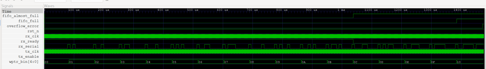

# UART Communication System with Asynchronous FIFO

A SystemVerilog RTL design and verification project targeting Digital IC Design and IC Verification roles.

The project integrates a UART receiver, Gray-code asynchronous FIFO, and UART transmitter into a complete multi-clock communication system. Data is received in a 50 MHz clock domain and transmitted in a 150 MHz clock domain through a 16-entry asynchronous FIFO.

## Architecture

```mermaid
flowchart LR
    A["Serial RX"] --> B["UART Receiver<br/>50 MHz"]
    B -->|"8-bit data"| C["Asynchronous FIFO<br/>16 × 8-bit"]
    C -->|"8-bit data"| D["UART Transmitter<br/>150 MHz"]
    D --> E["Serial TX"]


### 3. 在Implemented Features增加系统整合

放在Async FIFO段落后面：

```markdown
### Integrated UART FIFO System

- UART RX operating in the 50 MHz clock domain
- UART TX operating in the 150 MHz clock domain
- 115200 baud operation in both UART domains
- Asynchronous FIFO for clock-domain crossing
- End-to-end ordered-data verification
- FIFO overflow and UART framing-error monitoring
### UART Transmitter

- Configurable clock frequency and baud rate
- Start bit, 8-bit data and stop bit generation
- Busy and transmission-complete signals
- LSB-first serial transmission
- Self-checking testbench

### UART Receiver

- Start-bit detection
- Mid-bit data sampling
- 8-bit LSB-first data reception
- Stop-bit validation
- Framing-error detection
- Self-checking testbench

### Asynchronous FIFO

- Independent write and read clocks
- Parameterized data width and FIFO depth
- Binary-to-Gray pointer conversion
- Two-stage pointer synchronizers for CDC
- Full and empty flag generation
- Protection against writes while full
- Protection against reads while empty

## Design Parameters

| Component | Parameter | Value |
|---|---|---:|
| UART RX | Clock frequency | 50 MHz |
| UART TX | Clock frequency | 150 MHz |
| UART | Baud rate | 115200 |
| UART | Data width | 8 bits |
| FIFO | Data width | 8 bits |
| FIFO | Address width | 4 bits |
| FIFO | Depth | 16 entries |
| FIFO unit test | Write clock | 100 MHz |
| FIFO unit test | Read clock | Approximately 71.4 MHz |

## Verification

The project uses self-checking SystemVerilog testbenches instead of relying only on manual waveform inspection.

Verification includes:

- UART TX serial-data decoding and comparison
- UART RX data reception and comparison
- UART RX framing-error injection
- FIFO ordered-data checking
- FIFO full and empty condition checking
- Blocked write while full
- Blocked read while empty
- Pointer-stability assertions
- Functional coverage counters
- FIFO almost-full threshold at 12 of 16 entries
- FIFO almost-empty threshold at 2 entries
- Upstream flow control through `rx_ready`
- System-level threshold pause and resume verification
- Overflow error injection
- Protection against writes after FIFO full

### FIFO Coverage Result

```text
Successful writes : 16
Successful reads  : 16
Blocked writes    : 1
Blocked reads     : 1

[ASSERTION PASS] All FIFO assertions passed
[COVERAGE PASS] All planned events were observed
```
### End-to-End Verification Result

The integration test transmits five bytes through the complete data path:

```text
UART RX (50 MHz) -> Asynchronous FIFO -> UART TX (150 MHz)

[PASS] Byte 0: expected 0xA5, received 0xA5
[PASS] Byte 1: expected 0x3C, received 0x3C
[PASS] Byte 2: expected 0x00, received 0x00
[PASS] Byte 3: expected 0xFF, received 0xFF
[PASS] Byte 4: expected 0x5A, received 0x5A
[TEST PASS] UART FIFO end-to-end verification completed


### 6. 更新Project Structure

```markdown
## Project Structure

```text
│   └── uart_fifo_overflow_tb.sv
uart-async-fifo-verification/
├── assertions/
│   └── async_fifo_assertions.sv
├── rtl/
│   ├── uart_tx.sv
│   ├── uart_rx.sv
│   ├── async_fifo.sv
│   └── uart_fifo_system.sv
├── tb/
│   ├── uart_tx_tb.sv
│   ├── uart_rx_tb.sv
│   ├── async_fifo_tb.sv
│   └── uart_fifo_system_tb.sv
├── docs/
│   └── images/
│       ├── uart_fifo_end_to_end.png
│       └── uart_a5_detail.png
├── build/
├── scripts/
├── .gitignore
└── README.md

## Tools

- SystemVerilog
- Icarus Verilog
- GTKWave
- Visual Studio Code
- Git and GitHub

## Running the Simulations

Create the build directory before running the simulations.

### UART TX

```sh
iverilog -g2012 -s uart_tx_tb -o build/uart_tx_tb.vvp rtl/uart_tx.sv tb/uart_tx_tb.sv
vvp build/uart_tx_tb.vvp
```

### UART RX

```sh
iverilog -g2012 -s uart_rx_tb -o build/uart_rx_tb.vvp rtl/uart_rx.sv tb/uart_rx_tb.sv
vvp build/uart_rx_tb.vvp
```

### Asynchronous FIFO with Assertions

```sh
iverilog -g2012 -s async_fifo_tb -o build/async_fifo_tb.vvp rtl/async_fifo.sv assertions/async_fifo_assertions.sv tb/async_fifo_tb.sv
vvp build/async_fifo_tb.vvp
```

### Opening a Waveform

```sh
gtkwave build/async_fifo.vcd
```

## Current Progress

- [x] UART transmitter RTL
- [x] UART TX self-checking testbench
- [x] UART receiver RTL
- [x] UART RX self-checking testbench
- [x] UART framing-error verification
- [x] Asynchronous FIFO RTL
- [x] Asynchronous FIFO self-checking testbench
- [x] Assertions and functional coverage
- [x] UART RX, asynchronous FIFO and UART TX system integration
- [x] End-to-end multi-clock verification

## End-to-End Waveform

Five UART bytes are received in the 50 MHz RX clock domain, transferred
through the asynchronous FIFO, and transmitted in the 40 MHz TX clock
domain without data loss or reordering.


### UART Frame Detail

The waveform shows byte `0xA5` being received, written into the
asynchronous FIFO, read in the TX clock domain, and transmitted through
`tx_serial`.


### Reset and Startup Behavior

During active-low reset, both UART serial lines remain in the idle-high
state, the FIFO reports empty and almost-empty, and the upstream interface
is not ready. After reset is released, `rx_ready` is asserted and the
system begins normal operation.


### FIFO Threshold and Overflow Protection

The transmitter is intentionally disabled to fill the FIFO. At 12 entries,
`fifo_almost_full` is asserted and `rx_ready` is deasserted. A non-compliant
upstream sender continues transmitting until the FIFO reaches 16 entries.
The additional byte is blocked and `overflow_error` is asserted without
advancing the write pointer.



### UART FIFO Overflow Protection

```sh
iverilog -g2012 -s uart_fifo_overflow_tb -o build/uart_fifo_overflow_tb.vvp rtl/uart_tx.sv rtl/uart_rx.sv rtl/async_fifo.sv rtl/uart_fifo_system.sv tb/uart_fifo_overflow_tb.sv
vvp build/uart_fifo_overflow_tb.vvp

### Threshold and Overflow Protection

```text
[PASS] almost_full asserted after 12 bytes
[PASS] rx_ready deasserted at threshold
[PASS] FIFO full asserted after 16 bytes
[PASS] Overflow error detected
[PASS] Extra byte was blocked while FIFO was full
[TEST PASS] UART FIFO overflow protection completed