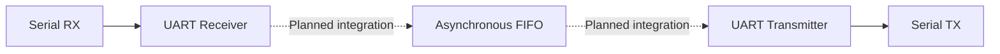

# UART Communication System with Asynchronous FIFO

A SystemVerilog RTL design and verification project targeting Digital IC Design and IC Verification roles.

The project currently includes independently verified UART transmitter, UART receiver, and asynchronous FIFO modules. Future work will integrate these modules into a complete multi-clock UART communication system.

## Architecture



## Implemented Features

### UART Transmitter

- Configurable clock frequency and baud rate
- Start bit, 8-bit data and stop bit generation
- Busy and transmission-complete signals
- LSB-first serial transmission
- Self-checking testbench

### UART Receiver

- Start-bit detection
- Mid-bit data sampling
- 8-bit LSB-first data reception
- Stop-bit validation
- Framing-error detection
- Self-checking testbench

### Asynchronous FIFO

- Independent write and read clocks
- Parameterized data width and FIFO depth
- Binary-to-Gray pointer conversion
- Two-stage pointer synchronizers for CDC
- Full and empty flag generation
- Protection against writes while full
- Protection against reads while empty

## Design Parameters

| Component | Parameter | Value |
|---|---|---:|
| UART | Clock frequency | 50 MHz |
| UART | Baud rate | 115200 |
| UART | Data width | 8 bits |
| FIFO | Data width | 8 bits |
| FIFO | Address width | 4 bits |
| FIFO | Depth | 16 entries |
| FIFO test | Write clock | 100 MHz |
| FIFO test | Read clock | Approximately 71.4 MHz |

## Verification

The project uses self-checking SystemVerilog testbenches instead of relying only on manual waveform inspection.

Verification includes:

- UART TX serial-data decoding and comparison
- UART RX data reception and comparison
- UART RX framing-error injection
- FIFO ordered-data checking
- FIFO full and empty condition checking
- Blocked write while full
- Blocked read while empty
- Pointer-stability assertions
- Functional coverage counters

### FIFO Coverage Result

```text
Successful writes : 16
Successful reads  : 16
Blocked writes    : 1
Blocked reads     : 1

[ASSERTION PASS] All FIFO assertions passed
[COVERAGE PASS] All planned events were observed
```

## Project Structure

```text
uart-async-fifo-verification/
├── assertions/
│   └── async_fifo_assertions.sv
├── rtl/
│   ├── uart_tx.sv
│   ├── uart_rx.sv
│   └── async_fifo.sv
├── tb/
│   ├── uart_tx_tb.sv
│   ├── uart_rx_tb.sv
│   └── async_fifo_tb.sv
├── build/
├── docs/
├── scripts/
├── .gitignore
└── README.md
```

## Tools

- SystemVerilog
- Icarus Verilog
- GTKWave
- Visual Studio Code
- Git and GitHub

## Running the Simulations

Create the build directory before running the simulations.

### UART TX

```sh
iverilog -g2012 -s uart_tx_tb -o build/uart_tx_tb.vvp rtl/uart_tx.sv tb/uart_tx_tb.sv
vvp build/uart_tx_tb.vvp
```

### UART RX

```sh
iverilog -g2012 -s uart_rx_tb -o build/uart_rx_tb.vvp rtl/uart_rx.sv tb/uart_rx_tb.sv
vvp build/uart_rx_tb.vvp
```

### Asynchronous FIFO with Assertions

```sh
iverilog -g2012 -s async_fifo_tb -o build/async_fifo_tb.vvp rtl/async_fifo.sv assertions/async_fifo_assertions.sv tb/async_fifo_tb.sv
vvp build/async_fifo_tb.vvp
```

### Opening a Waveform

```sh
gtkwave build/async_fifo.vcd
```

## Current Progress

- [x] UART transmitter RTL
- [x] UART TX self-checking testbench
- [x] UART receiver RTL
- [x] UART RX self-checking testbench
- [x] UART framing-error verification
- [x] Asynchronous FIFO RTL
- [x] Asynchronous FIFO self-checking testbench
- [x] Assertions and functional coverage
- [x] UART RX, asynchronous FIFO and UART TX system integration
- [x] End-to-end multi-clock verification